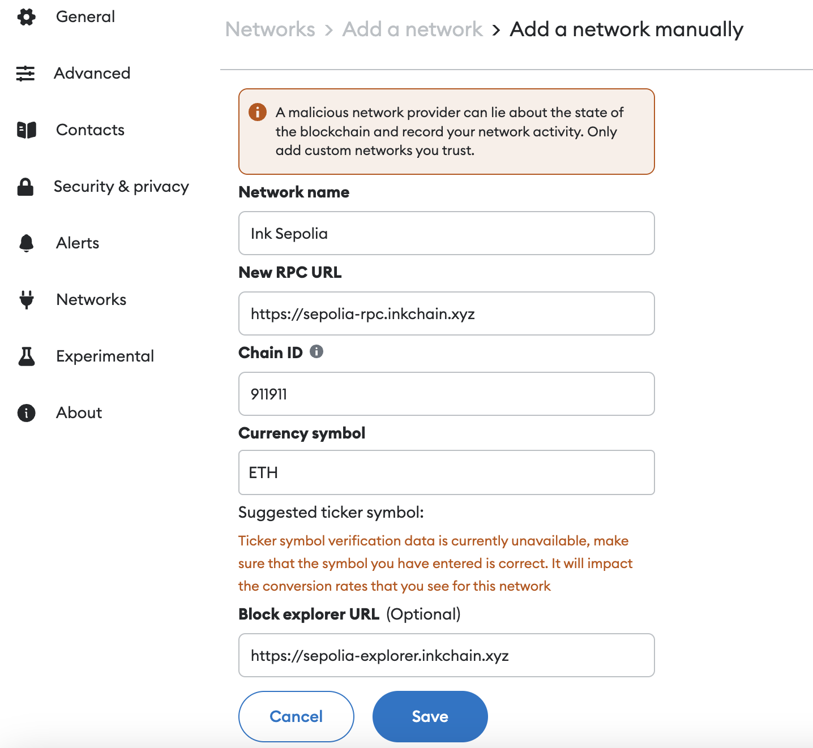

import { AddNetworkButton } from "../../components/AddNetworkButton";

# Get Connected

Step-by-step instructions for the following:

Adding Ink testnet to Metamask, both via our blockscout explorer, and manually via metamask.

<AddNetworkButton />

## Network Information

| Field           | Information                                                    |
| --------------- | -------------------------------------------------------------- |
| Network Name    | Ink Sepolia                                                    |
| Description     | Ink's public testnet                                           |
| RPC Endpoint    | [https://sepolia-rpc.inkchain.xyz](https://sepolia-rpc.inkchain.xyz)   |
| Chain ID        | 911911                                                         |
| Currency Symbol | ETH                                                            |
| Block Explorer  | [https://sepolia-explorer.inkchain.xyz](https://sepolia-explorer.inkchain.xyz) |

## Connecting Web3 Wallets

In order to connect your to Ink Sepolia you must add it as a custom network. Note that your wallet should be EVM-compatible.

###### Adding Ink Sepolia to Metamask wallet
    1. Open your Metamask browser extension.
    2. Open the network selection dropdown menu by clicking the dropdown button at the top left of the extension.
    3. Click the "+ Add network" button at the bottom.
    4. A new window should open. Click "Add a network manually" at the bottom of the list.
    5. In the dialog that appears, enter the information listed in [Network Information](#network-information). See screenshot below.
    6. Click "Save".
    7. When clicking on the network selection dropdown you can now select Ink Sepolia to connect to.

Next: get some [play money](#faucet) from our faucets!

## Faucet
Get fake Ether (ETH) from these faucets so you can fund your wallet to send transactions and deploy contracts on Ink Sepolia.

- Kraken 
    -  Our in house faucet provides a quick and easy way to acquire testnet ETH.
    - https://faucet.ink.kraken.zone/
- Quicknode
    - Quicknode faucet is an easy to use Multi-Chain Faucet. You can use Quicknode Faucet to claim Ink Sepolia for testnet ETH for free - one drip per network every 12 hours.
    - https://quicknode.com
- Tenderly
    - Tenderly Node is a fast and reliable production node that enables access to over 12 blockchain networks via RPC. It allows you to send transactions, deploy smart contracts, query blockchain data or other operations without having to run your own node or manage infrastructure.
    - https://tenderly.co 
- Optimism
- Superchain
    - The Superchain Faucet provides testnet ETH for all OP chains, including Ink.

You can also [bridge](#bridges) ETH to Ink Sepolia.

## Bridges

Users can send ETH from other chains to Ink Seplia using bridges.

###### Bridge ETH manually using the canonical bridge contract

"Canonical" here means that the bridge can be reached at the same address no matter what chain.

1. Ensure you are connected to a chain where you have testnet Ether different from Ink Sepolia.
2. Send Ether from your wallet to canonical bridge address: 0x...
3. Once the transaction is confirmed, switch to Ink Sepolia and you should see the bridged Ether.

###### Bridge ETH using Kraken's interface

###### 3rd Party Bridges

## Public RPC Endpoints

* [https://sepolia-rpc.inkchain.xyz](https://sepolia-rpc.inkchain.xyz)

## Troubleshooting

If the above button doesn't work, try:
1. Disabling Phantom Wallet if installed
